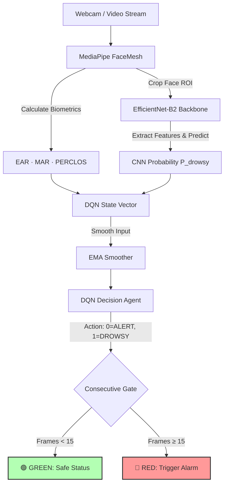

# 😴 Driver Drowsiness Detection System (v1.0)

[](https://www.python.org/)
[](https://pytorch.org/)
[](https://opencv.org/)
[](https://github.com/google-ai-edge/mediapipe)

An enterprise-grade, high-accuracy driver drowsiness detection system combining a deep learning feature extractor, facial landmarks biomechanics, and a context-aware **Deep Q-Network (DQN)** decision-making agent.

---

## 📌 Architecture Pipeline

The system processes real-time video frames sequentially, passing them through a multi-stage decision pipeline:



---

## ✨ Core Features & Key Advantages

* **High-Accuracy Neural Backbone**: Uses **EfficientNet-B2** for facial feature extraction, achieving superior accuracy compared to standard lightweight models (like MobileNetV3) by utilizing Squeeze-and-Excitation blocks.
* **No Calibration Required**: Designed to be generic and robust out-of-the-box, removing the friction of manual user calibration while leveraging dynamic biomechanical features.
* **Dual-Signal Decision Layer**: Integrates high-level convolutional neural network outputs with physical facial landmarks (Eye Aspect Ratio, Mouth Aspect Ratio) for multi-modal verification.
* **Context-Aware Reinforcement Learning**: Employs a **Double DQN agent** to learn optimal warning thresholds, using a proxy reward system linked to the CNN confidence score.
* **Anti-Flicker & False Positive Gating**: Eliminates single-frame noise and accidental blinks using an **Exponential Moving Average (EMA)** smoother combined with a **Consecutive Frames Gate** (requiring 15 consecutive frames of drowsiness to trigger an alert).
* **Robust Augmentations**: Uses the `albumentations` pipeline with coarse dropout, shadow simulation, and elastic transformations to simulate realistic in-car lighting, vibration, and face occlusions.
* **Windows Native Audio System**: Features low-latency, loop-able audio alerts using the native `winsound` package.

---

## 🛠️ Tech Stack & Mechanics

### 1. Biometrics (MediaPipe FaceMesh)
* **Eye Aspect Ratio (EAR)**: Computes eye openness by calculating relative distance ratios between vertical and horizontal eye landmarks. Hard override triggers if $EAR < 0.18$ (forced blink detection).
* **Mouth Aspect Ratio (MAR)**: Monitors inner-lip distance to identify yawns ($MAR > 0.50$).
* **PERCLOS (Percentage of Eye Closure)**: Calculated over a rolling 60-frame (~2 seconds) window, tracking the percentage of time the eyes are closed ($EAR < 0.20$).

### 2. Deep Learning Classifier (EfficientNet-B2)
* Fine-tuned on cropped faces using `timm`.
* **Classification Head**: `Linear(512)` ➔ `BN` ➔ `GELU` ➔ `Dropout(0.4)` ➔ `Linear(256)` ➔ `Linear(1)`.
* **Focal Loss**: Configured with $\gamma=2.5$ and $\alpha=0.75$ to aggressively down-weight easy negative examples and focus on hard-to-classify eyelid states.
* **Warm-up Phase**: Backbone is frozen for the first 5 epochs, after which full fine-tuning commences with a 10x smaller learning rate on the backbone compared to the head.

### 3. Contextual Reinforcement Learning (DQN)
* **State Space $\mathbb{S}$** ($5$-dimensions): $[P_{\text{drowsy}}, EAR, MAR, PERCLOS, \text{Consecutive Drowsy Frames Norm}]$.
* **Action Space $\mathbb{A}$** ($2$-dimensions): $0 = \text{ALERT}$, $1 = \text{DROWSY}$.
* **Reward Structure**: Proxy rewards computed using the CNN confidence $p$ as an oracle:
  * *Drowsy action*: $+15.0 \times p - 20.0 \times (1 - p)$
  * *Alert action*: $+15.0 \times (1 - p) - 20.0 \times p$
* **Exploration vs. Exploitation**: Uses an $\epsilon$-decay strategy ($0.8 \rightarrow 0.005$) where random actions are replaced with direct CNN threshold-based choices to maintain safety during exploration.

---

## 📁 Repository Structure

```text
├── dataset/                     # Project Dataset (organized by split and class)
│   ├── train/ [alert/, drowsy/]
│   ├── val/   [alert/, drowsy/]
│   └── test/  [alert/, drowsy/]
├── outputs/                     # Generated logs, charts, and checkpoints
│   ├── checkpoints/             # Model checkpoints (*.pt)
│   └── reports/                 # Confusion matrices and ROC curves
├── check_rl.py                  # Utility to query DQN Agent state and simulate policies
├── config.yaml                  # Unified project hyperparameter configurations
├── dataset.py                   # Custom PyTorch Dataset with Albumentations pipeline
├── evaluate.py                  # Model evaluation suite (Confusion Matrix, ROC, metrics)
├── feature_extractor.py         # MediaPipe FaceMesh biometric calculation wrapper
├── inference.py                 # Real-time inference application (Webcam/Video source)
├── model.py                     # EfficientNet-B2 architecture & loss function definition
├── requirements.txt             # Project dependencies
├── train.py                     # High-accuracy training loop
└── README.md                    # Project documentation (this file)
```

---

## 🚀 Setup & Installation

### 1. Prerequisites
* Windows OS (System sound alerts use the native `winsound` package).
* Python 3.8 or higher.
* NVIDIA GPU (recommended for training, though inference runs smoothly on CPU).

### 2. Virtual Environment Setup
```bash
# Clone the repository
git clone https://github.com/vaibhav-goyal-dev/drowsiness-detection-dqn.git
cd drowsiness-detection-dqn

# Create a virtual environment
python -m venv venv
venv\Scripts\activate

# Install dependencies
pip install -r requirements.txt
```

---

## 💻 Usage Instructions

### 1. Test Webcam & FaceMesh Pipeline
To verify camera feeds, face tracking, and biometrics computation without loading any neural network weights:
```bash
python inference.py --rule-only
```

### 2. Train the CNN Backbone
Train the EfficientNet-B2 classifier on your custom dataset. The code utilizes PyTorch automatic mixed precision (AMP) for faster training.
```bash
# Run training using config.yaml defaults
python train.py

# Customize training parameters via CLI overrides
python train.py --epochs 60 --batch-size 32 --lr 0.0003

# Run a 2-epoch dry run/smoke test to verify dataset pipeline
python train.py --dry-run

# Resume training from a specific epoch checkpoint
python train.py --resume outputs/checkpoints/checkpoint_epoch020.pt
```

### 3. Real-Time Inference
Run the real-time webcam detector with the trained classifier and DQN policy agent.
```bash
# Run with default checkpoint path
python inference.py --checkpoint outputs/checkpoints/best_model.pt

# Run using a custom video file source instead of webcam
python inference.py --checkpoint outputs/checkpoints/best_model.pt --source path/to/video.mp4

# Save output video overlay
python inference.py --checkpoint outputs/checkpoints/best_model.pt --save-output output_demo.mp4
```
**Keyboard Controls:**
* `Q` or `ESC`: Quit the application.
* `F`: Toggle fullscreen display.

### 4. Evaluation Suite
Evaluate the CNN model on your testing subset, printing metrics and plotting performance curves.
```bash
python evaluate.py --checkpoint outputs/checkpoints/best_model.pt
```
This saves:
* **Confusion Matrix** (`outputs/reports/confusion_matrix.png`)
* **ROC Curve** (`outputs/reports/roc_curve.png`)
* **Metrics Data** (`outputs/reports/metrics.json`)

### 5. Check RL Agent Status
Check the status of the DQN agent and simulate policy choices against hypothetical driver states (Normal, Blinking, Heavy Drowsy, Yawning):
```bash
python check_rl.py
```

---

## 🎯 Target Performance Benchmarks

| Metric | Target Specification | Goal Description |
| :--- | :--- | :--- |
| **Accuracy** | $\ge 90\%$ | Correctly classify overall driving frames. |
| **Recall (Drowsy)** | $\ge 95\%$ | Minimize missed drowsiness events (critical safety constraint). |
| **F1-Score (Drowsy)** | $\ge 0.90\%$ | Balance positive alerts and avoid false alarms. |
| **ROC-AUC** | $\ge 0.95\%$ | Model separation capability across thresholds. |
| **False Negative Rate** | $\le 5\%$ | Drowsy frames categorized as alert (safety hazard). |

---

## ⚙️ Configuration File (`config.yaml`)

You can fully customize model sizes, augmentations, and training hyperparameters in `config.yaml`:

```yaml
model:
  backbone: "efficientnet_b2"
  pretrained: true
  dropout: 0.4
  unfreeze_at_epoch: 5          # Warm-up phase duration

training:
  epochs: 60
  batch_size: 32
  learning_rate: 0.0003
  focal_loss_gamma: 2.5
  mixup_alpha: 0.2

rl:
  gamma: 0.97
  epsilon_start: 0.8
  epsilon_decay: 0.998
  min_buffer_before_train: 500  # Warmup steps for RL memory buffer
```

---

## 📄 License
Distributed under the MIT License. See `LICENSE` for details.
